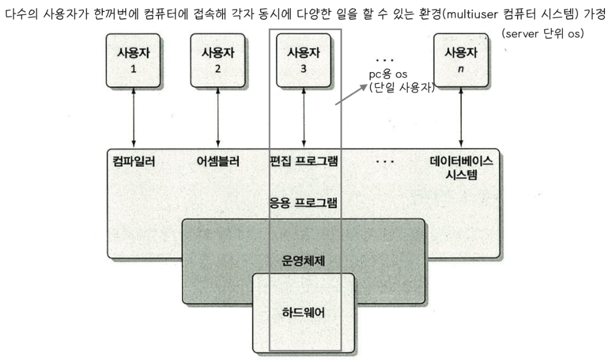
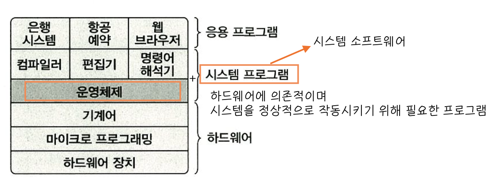

# 운영체제 Intro

## 운영체제란?

컴퓨터 Hardware 바로 위에 설치되어 사용자 및 다른 Software과 Hardware를 연결하는 소프트웨어 계층

컴퓨터에 여러 응용 프로그램이 설치되게 해주고 여러 장치들을 효율적으로 작동할 수 있게 해주는, 즉 사용자 인터페이스와 자원 관리를 위한 프로그램의 집합

## 운영체제의 목적

(1) 컴퓨터 시스템을 편리하게 사용할 수 있는 환경 제공

- 하드웨어를 직접 다루는 복잡한 부분을 운영체제가 대행해준다.

(2) 자원(CPU, Memory, I/O device) 을 효율적으로 관리

- 효율성 : 주어진 자원으로 최대 성능을 내도록 하기

- 형평성 : 특정 사용자/프로그램에 지나친 불이익이 없도록(한 프로그램에만 계속 메모리 할당해주기) 하기

- 실행 중인 프로그램들에게 짧은 시간씩 CPU를 번갈아 할당 >> Time sharing(시분할 시스템), CPU 스케줄링 파트

    -  Memory는 CPU의 작업 공간으로, 프로그램이 실행되려면 Memory에 load되어야함

    - 운영체제는 실행 중인 프로그램들에 메모리 할당 시간을 적절히 분배한다.

## 컴퓨터 시스템 구조

- cpu는 memory에 있는 프로그램을 읽어다 실행함

- cpu는 외부 장치에 직접 접근할 수 없음 -> I/O를 담당하는 작은 cpu들이 붙어있고(**I/O Controller**), cpu가 I/O controller에 부탁

## 운영체제의 기능

- cpu 스케줄링 : 어떤 프로그램이 cpu를 사용하도록 할 것인지 결정

    - 실제로는 하드웨어 장치와 협조해서 cpu 뺏어오지 운영체제 자체가 cpu 뺏어올 수 있진 않습니다

- 메모리 관리 : 한정된 메모리를 어떻게 쪼개서 쓸지

- 디스크 스케줄링 : 디스크에 들어온 요청 어떤 순서대로 처리할지

- 인터럽트, 캐싱 : cpu와 I/O 장치 간 속도 차이를 어떻게 극복할지
    

## 중간 중간 튀어나오는 용어들 정리

###  인터럽트

현재 컴퓨터 시스템에 존재하는 각 자원들의 상황을 파악하는 방법들(폴링, 인터럽트) 중 하나로, 각 자원들이 능동적으로 cpu에게 자신의 상태변화를 알린다.

- Hardware Inturrupt : 하드웨어 자원으로부터의 인터럽트
    : 아래 그림처럼 현재 진행 중인 명령어 실행을 마친 후 처리된다.
    
    
    : 명령어 실행 주기

    +) High level에서 코드는 statement(명령문), Assembler level에서의 코드는 Instruction(명령어) 

- Software Inturrpt : cpu 스스로 자신에게 인터럽트 (Trap)
    : 명령어 오류(div by 0, 다른 사용자 주소 참조 등) 또는 시스템 호출(print) 처럼 실행 중인 명령어 때문에 발생

    : 오류일 경우 프로그램 종료
    
    : 시스템 콜일 경우 입출력 완료 후 실행 중인 명령어가 완료되고 다음 실행문으로 진행

캐싱

    메모리에 올라왔었던거 똑같은 요청 들어왔을 때 디스크까지 가지 않고 미리 저장해놓은거 사용

