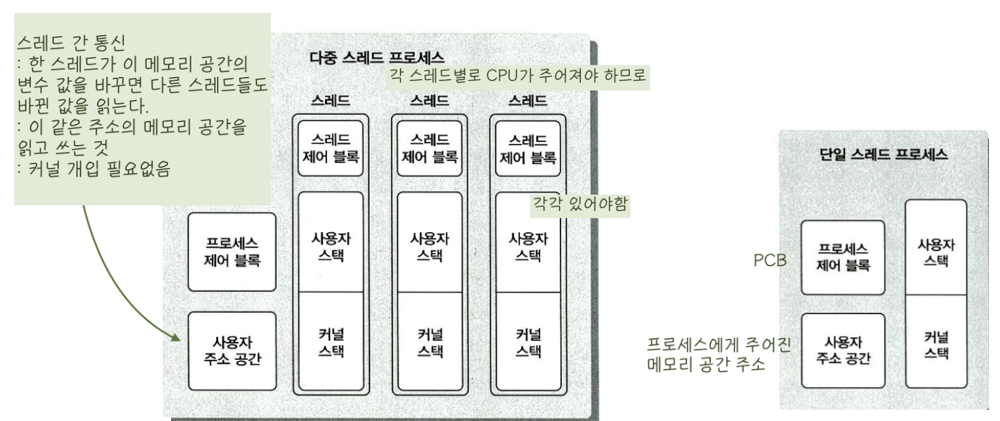
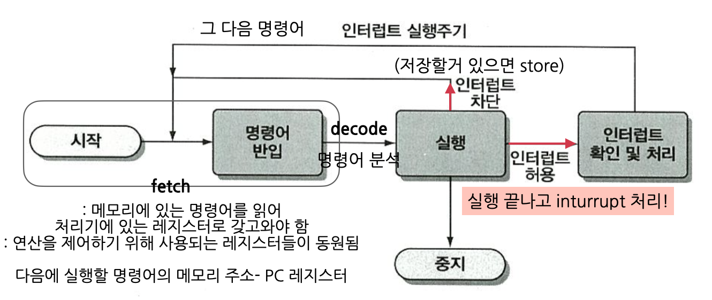
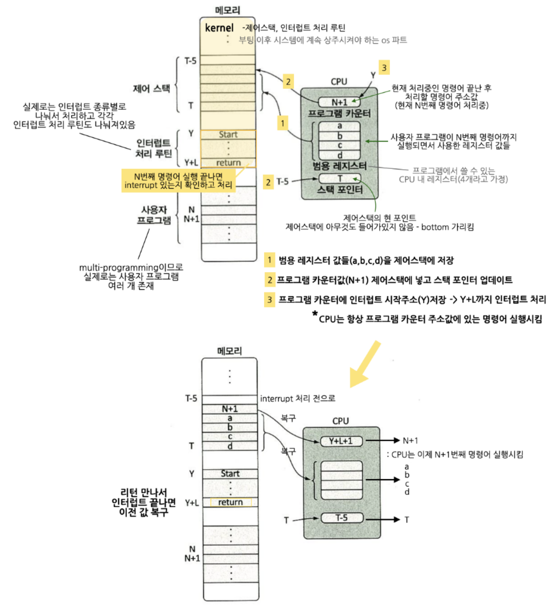
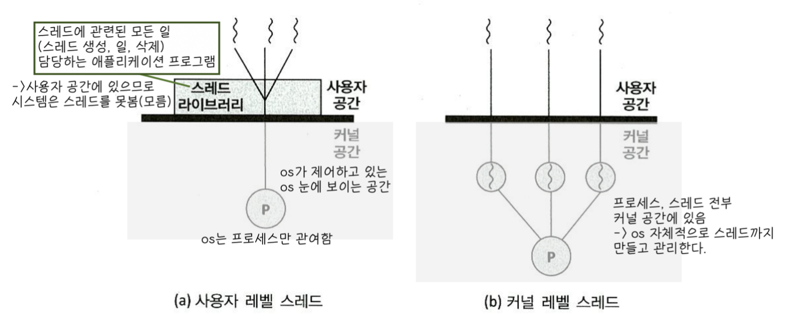
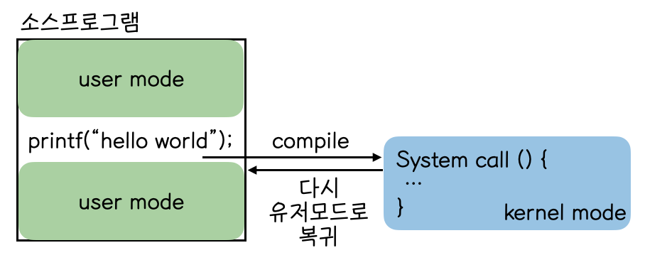

# Process

   
<strong>
   process vs thread 
   </strong>

   

   process 

    : 컴퓨터 시스템에서 처리하는 일의 단위(프로그램) 이다.
    : 고유한 공간과 자원을 할당받아 실행된다.
  
   thread 

    : "프로세스 안에서" 프로세스 내 작은 일들을 각각 하나의 실행 단위로 세분
    : 각 스레드는 고유한 스택을 할당받고, 프로세스 내애서 서로 자원을 공유한다.

  process는 부여받은 자원의 소유자로, cpu를 주는 단위, 

  thread는 스케줄링의 단위, cpu 힐당 단위

  process 하나에 속한 각 thread들은 process가 갖는 자원을 공유하면서 각각 자신의 실행 환경(프로그램 카운터로 표현되는 현재 실행 위치, 스택, 레지스터 값들)을 갖는다.
   

 

   
<strong>
     multi-programming , multi-processing , multi-thread
   </strong>

   

   multi-programming 
   
    : cpu를 받게 될 여러개의 후보 작업들(programs)이 memory에 함깨 올라가있도록 하는 방식
    : 작업 처리 도중 i/o 발생 시 디스크에서 메모리로 갖고오는 시간은 매우 길고 실제 cpu를 사용하는 시간은 짧기 때문에, 바로 cpu가 다른 작업을 처리할 수 있게 작업대(메모리)에 여러 프로세스를 올려놓는 것

   multi-processing 
   
    : 다중 처리 시스템으로, 여러 개의 처리장치(Processor)를 장착하여 병렬로 동시에 여러 작업을 실행하는 방식 (cpu가 여러개)
    : 하나의 프로세스가 죽더라도 다른 프로세스에는 영향을 끼치지 않고 정상적으로 수행된다.
    
  multi-threading
    
    : 하나의 프로세스를 다수의 스레드로 만들어서 실행하는 것
    : 프로세스 내 다수의 실행 단위들이 자원들을 공유하므로, 자원의 생성과 관리가 중복되는 것을 줄일 수 있다. (프로세스 하나 생성 <간단< 스레드 하나 생성)
        - 자원 공유 = 한 스레드에 의해 메모리의 데이터가 변경될 경우 다른 스레드들은 변경된 데이터를 사용하는 것
    : 여기서 프로세스는 보호와 자원 할당 단위가 된다. 
        - 코드와 데이터를 위한 가상 주소공간
        - cpu
        - 다른 프로세스들의 파일들
        - 입출력에 사용되는 자원에 대한 보호된 엑세스를 보장하기 위한 단위
    : 스레드 각각은 수행 상태를 갖는다.
        - 다른 스레드로 cpu가 넘어갈 때를 위한 스레드 문맥
        - 각 실행 스택
        - 속해있는 프로세스가 갖는 메모리와 자원에 대한 접근 권한
    : 스레드 생성, 삭제, Switching에 소요되는 시간/비용이 프로세스 단위로 실행될 때보다 빠르고 저렴 :)
        - 스레드 간 통신은 커널이 개입하지 않기 때문
        - 프로세스 간 통신은 커널의 개입이 필요( -> 2번의 Mode Switching)

   

 

   
<strong>
     스레드마다 스택을 독립적으로 할당하는 이유
   </strong>

   

   스택 : 함수 호출 시 전달되는 인자, 복귀 주소값, 함수 내에서 선언하는 변수 등을 저장하기 위한 메모리 공간

   스택 메모리 공간이 독립적이라는 것은 독립적인 함수 호출이 가능하다는 것을 의미한다.

   이는 독립적인 실행 흐름을 추가한다는 것이기 때문에, 스레드에 독립된 스택(사용자 스택, 커털 스택)이 할당되어야 한다.
   

 

   
<strong>
     스레드마다 pc 레지스터를 독립적으로 할당하는 이유
   </strong>

   

   pc 값 : 스레드가 명령어의 어디까지 수행했는지 진행 정도를 나타내는 값

   스레드는 cpu를 할당받았다가 스케줄러에 의해 다시 선점당한다. 따라서 명령어의 어느 부분까지 수행했는지 기억해야 하고, 스레드마다 pc 레지스터를 독립적으로 할당하는 것.
   

 

   
<strong>
     multi thread의 장점
   </strong>

   

   어떠한 작업을 수행하기 위해 여러 개의 프로그램으로 소일거리를 나눠놓는 것보다 하나의 프로그램 안에서 여러 작업으로 나눠 해결하는 것이 훨씬 효율적이다. (단일 스레드 다중 프로세스 << 다중 스레드 단일 프로세스)

   프로세스를 생성하여 자원을 할당하는 System Call이 줄어들어 자원을 효율적으로 관리할 수 있다.

   

 

   
<strong>
     Inturrupt [인터럽트]
   </strong>

   

   os가 자원을 효율적으로 관리하기 위해 현재 컴퓨터 시스템에 존재하는 각 자원들의 상황을 파악하는 방법들(폴링, 인터럽트) 중 하나

 

    폴링

cpu가 직접 일정 시간 간격을 두고 각 자원들의 상태를 주기적으로 확인하는 방식이다. 구체적으로 말하면 자원들은 폴링 신호를 받으면 자신의 상태를 적어놓을 수 있는 곳애 저장시키고, cpu는 폴링 때 이를 읽어보는 방식이다. 얘는 폴링 전에는 자원들이 자신의 상태를 알릴 수 없고, 아무 일이 없어도 cpu가 폴링에 시간을 써야하니까 비효율적이다.

 
인터럽트

    : 자원들이 cpu에게 직접 자신의 상태를 알리는 방식이다. 
    - Hardware Inturrupt : 하드웨어 자원으로부터의 인터럽트
    : 아래 그림처럼 현재 진행 중인 명령어 실행을 마친 후 처리된다.
    

    : 명령어 실행 주기

    +) High level에서 코드는 statement(명령문), Assembler level에서의 코드는 Instruction(명령어) 

    - Software Inturrpt : cpu 스스로 자신에게 인터럽트 (Trap)
    : 명령어 오류(div by 0, 다른 사용자 주소 참조 등) 또는 시스템 호출(print) 처럼 실행 중인 명령어 때문에 발생
    : 오류일 경우 프로그램 종료
    : 시스템 콜일 경우 입출력 완료 후 실행 중인 명령어가 완료되고 다음 실행문으로 진행

<strong>인터럽트 처리 과정</strong>

    
    1. 장치 ---인터럽트 신호---> cpu
    2. cpu는 명령 실행 중이였으면 실행 다 끝내고 인터럽트 신호를 확인함
    3. 현재 실행 중이던 프로그램의 상태 정보를 시스템 스택에 저장함
        인터럽트는 os 프로그램이 컴퓨터 시스템 내 각종 레지스터를 사용해서 처리해야 하는 것이기 때문에, 인터럽트 처리 후 다시 실행하기 위해 현재 상태 정보(PSW, PC레지스터 값들)을 저장해둬야함
    4. 인터럽트 처리 루틴의 시작주소 PC에 넣음(=실행시키기)
    5. cpu에 있는 레지스터 값들 저장, 인터럽트 처리
    6. 처리 완료하면 이전 레지스터 값들 재저장하고 PSW, PC값들 원래 자리에 넣어주고 실행
    7. 다음 명령어로 !
   

 

   
<strong>
     Context Switching [문맥교환]
   </strong>

   

   현재 진행중이던 Task(process, thread)의 상태를 PCB에 저장하고 다음에 진행할 Task의 상태를 읽어 적용하는 과정
   

 

   
<strong>
     프로세스/스레드 동기화란?
   </strong>

   

   병렬적으로 수행되는 작업들에 대해 자원 접근 순서를 정해 각자 알고있는 정보가 일치하도록 하는 것이다.

   

     스레드 동기화
   

   

   스레드는 실행, 준비, 대기, 종료 상태를 갖는다.

       - 대기 : 레지스터 값, 프로그램 카운터, 스택 포인터 등을 보관한다.
       - 종료 : 스레드의 레지스터 값과 스택을 없앤다.
       - 보류는 프로세스 레벨의 상태다. (프로세스가 메모리 뺏기면 당연 스레드도 뺏김)
    한 프로세스 내의 스레드들은 프로세스 주소 공간, 자원을 모두 공유하기 때문에 특정 스레드가 변경시킨 내용이 다른 스레드에게 영향을 미친다. 따라서 스레드 실행도 동기화가 필요한 것 !
   

   

 

   
<strong>
     사용자 수준의 스레드 vs 커널 수준의 스레드
   </strong>

   

   사용자 레벨 스레드

        : 스레드 라이브러리에 의해 관리되며, 스레드에 관련된 모든 행위가 사용자 공간에서 이루어지므로 커널은 스레드의 존재를 모른다. 따라서 스레드들 각자가 일으키는 작업을 그 스레드가 속한 프로세스가 하는 거라고 인식한다. 
        : 스레드 스위칭에 커널의 개입 필요 없음 :)
        : 다중처리 환경이 주어져도 스레드 단위로 cpu 주는 다중처리 불가 :(
        : 특정 스레드 실행에서의 대기(blocking) =  소속된 프로세스 전체가 blocked :(

    커널 레벨 스레드
        : 모든 스레드를 커널이 관리하며, 스케줄링이 커널에 의해 스레드 단위로 이루어진다.
        : 따라서 다중처리환경일 경우 스레드들이 병렬로 실행 가능하고,
        : 한 스레드가 blocking되면 같은 프로세스에 속한 다른 스레드로 스위칭이 가능하다. :)
        : 같은 프로세스에 속한 스레드 간 스위칭에도 커널의 개입이 필요해서 총 2번의 Mode Switching이 발생한다.(user mode <-> kernal mode) :(

   

 

   
<strong>
     System Call [시스템콜]
   </strong>

   

   사용자 프로그램에서 읽기, 쓰기 등 디스크/메모리 access에 필요한 일이 발생할 경우(유저 모드로 실행되다가 커널 모드에서 할 수 있는 일이 생길 경우) 
   
   커널 모드에서 그 일을 해줄 운영체제 프로그램이 실행된 후 다시 사용자 프로그램으로 복귀한다.

   

 

   
<strong>
     
   </strong>

   

   
   

