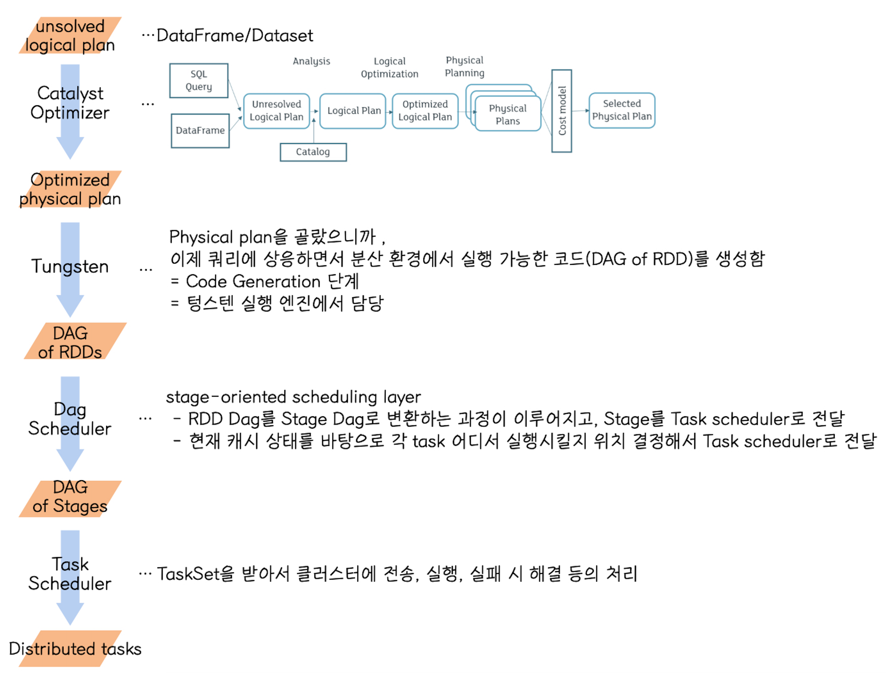
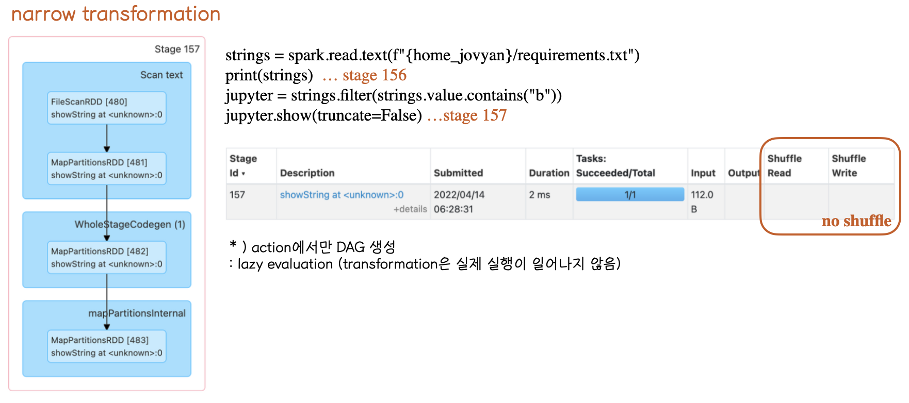
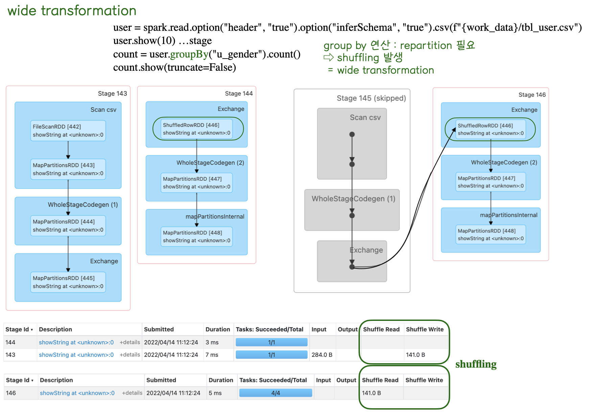

# Spark
궁금한/모호한 개념들과 해답을 찾기 위한 삽질, 나름의 결론

<details>
   <summary><strong><span style="font-size:110%">
     saveAsTable() - save modes
   </span></strong></summary>
<hr>
   <p>

   - DataFrame을 테이블로 저장(~materialize)한다.
  
   - Hive MetaStore (spark.sql.warehouse.dir)에 **영구 테이블로 저장**한다는 것
     - 🤔 그럼 Hive가 설치되어있어야 하는건가? 
     - 놉 스파크는 기본적으로 local Hive metastore를 생성하기 때문에, Hive 배포 여부와는 무관하다.
   - `CreateOrReplaceTempView` 커맨드와 달리 `saveAsTable`은 DataFrame의 내용(데이터)들을 **materialize하고**, 데이터에 대한 **포인터**를 **Hive metastore**에 생성
   - 따라서 spark 프로그램이 다시 시작됐더라도, 테이블들이 영구적으로 존재하게 되고, 이 맥락에서 "영구 테이블로 저장" 한다는 것이다.
   - 영구 테이블로 저장했으니깐 SparkSession의 table 메소드을 사용해서 DataFrame으로 불러올 수 있다.
   </p>
<hr>
</details>

<br>

<details>
   <summary><strong><span style="font-size:110%">
     Spark ui에서 DAG visualization을 보면 DAG를 가지고 스케줄링을 하는 것 같은데, catalyst optimizer과 관련이 있는건가?
   </span></strong></summary>
<hr>
   <p>
   
   - Catalyst Optimizer 와 Dag scheduler 둘 다 physical execution plan을 생성한다는 점에서 유사해서, 혼란스러웠다.
  
  Catalyst Optimizer

   - 사용자의 쿼리와(정확하게는 SQL 파서가 반환한 추상 구문 트리) DF/DS를 받아서 **최적의 physical plan을 골라 RDD Dag** 를 생성
   
   Dag Scheduler

   - 이 RDD Dag를 받아서 **stage 단위**로 **physical execution plan을 생성**해 Task Scheduler에 전달한다. 
   - spark ui 에서 확인 가능한 Dag visualization 은 이 stage의 세부 정보로써 RDD와 operation 정보를 그래프로 보여주고 있는 것 !


   </p>
<hr>
</details>

<br>

<details>
   <summary><strong><span style="font-size:110%">
     wide transformation vs narrow transformation
   </span></strong></summary>
<hr>
   <p>
  
   - spark ui에서 확인했을 떼, groupBy 연산 시(  count = user.groupBy("gender").count()  ) Shuffle Read, Shuffle write에 걸린 시간이 나오는 걸 확인할 수 있었다.
   - 이 job은 group by 연산을 위해 **shuffling**이 발생한 **wide transformation**이기 때문에, 이러한 결과가 나온 것
   - shuffling 발생 연산 
      : repatitioning을 유발하는 연산은 조인, 리듀스, 그룹핑, 집계 연산
     - groupByKey(), reduceByKey(), join(), union(), groupBy()
   - narrow transformation job과 비교해서 정리해봤다.
  
  
   </p>
<hr>
</details>

<br>

<details>
   <summary><strong><span style="font-size:110%">
     groupbyKey() vs reducebyKey()
   </span></strong></summary>
<hr>
   <p>
   
   - 둘 다 wide transformation으로, `shuffle operation`을 트리거한다.
   - 차이점은 `reduceByKey()`는 `map side combine`, `groupByKey()`는 아님

   RED GREEN RED RED 이 line을 갖고있는 파일을 wordcount 계산해야하고, 런타임에 2개의 partitions 으로 끝난다고 가정하자.

   ```
   Partition 1
   RED
   GREEN
   Partition 2
   RED
   RED
   ```
<details>
   <summary><strong><span style="font-size:110%">
   groupByKey()
   </span></strong></summary>
<hr>
   <p>
      2개의 파티션이 있으므로 2개의 작업으로 끝낸다. 

   Task outputs

   ```
   Task 1
   RED, 1
   GREEN, 1
   Task 2
   RED, 1
   RED, 1
   ```

   작업 1, 2의 모든 요소는 네트워크를 통해 `reduce operation`을 수행하는 작업으로 전송된다.

   Task performing reduce

   ```
   RED, 1
   GREEN, 1
   RED, 1
   RED, 1
   ```

   Yielding the result

   ```
   GREEN 1
   RED 3
   ```
   문제점 1. 데이터가 map side에서 combined/reduced되지 않기 때문에, shuffle 하는 동안 네트워크 통해서 이 모든 element들을 다 전송해야한다.

   문제점 2. 모든 element들이 aggregate 연산을 수행하는 task에게 보내지기 때문에, task에서 처리해야 할 요소가 더 많아지고 메모리 부족 예외가 발생할 수 있다.
   </p>
<hr>
</details>

<details>
   <summary><strong><span style="font-size:110%">
   reduceByKey()
   </span></strong></summary>
<hr>
   <p>

reduceByKey()는 `map side combine`으로 `최적화`되었다.

위와 똑같이 2개의 partition이기 때문에 2개의 task로 끝난다. 근데 map side combine이기 때문에, task 출력해보면 이렇다.

```
Task 1
RED, 1
GREEN, 1
Task 2
RED, 2
```

작업 1, 2의 단 3개의 elements만 `reduce operation`을 수행하는 작업에게 네트워크를 통해 전송된다.

Task performing reduce

```
RED, 1
GREEN, 1
RED, 2
```

yielding the result

```
GREEN 1
RED 3
```
map side aggreagate로 인해 reduceByKey()가 최적화된다. 네트워크를 통해 전송되는 요소 수가 확 줄어든다. 

shuffle 이후 reduce 연산을 수행하는 task에서 더 적은 수의 elements가 reduce된다
   </p>
<hr>
</details>

   </p>
<hr>
</details>

<br>

<details>
   <summary><strong><span style="font-size:110%">
     
   </span></strong></summary>
<hr>
   <p>
   
   </p>
<hr>
</details>

<br>

<details>
   <summary><strong><span style="font-size:110%">
     
   </span></strong></summary>
<hr>
   <p>
   
   </p>
<hr>
</details>